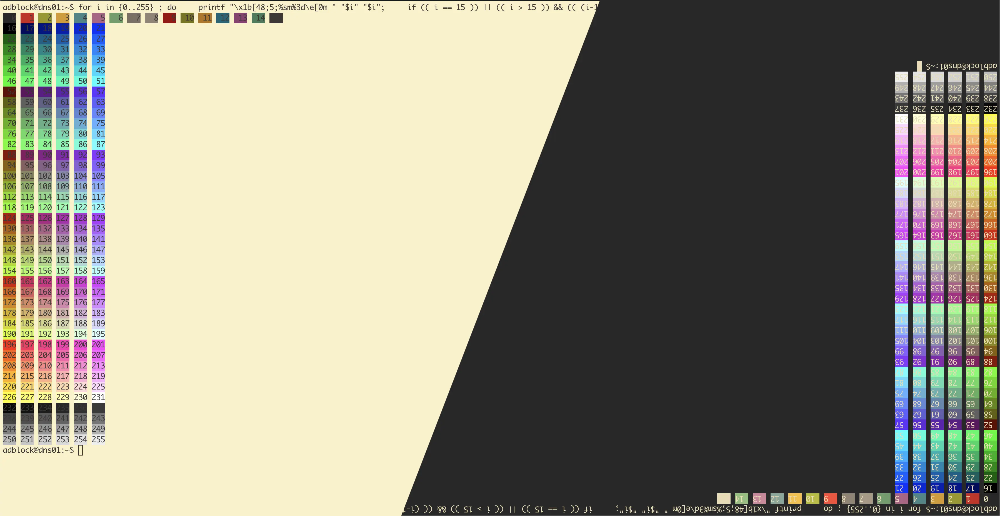

<h3 align="center">
	
	<a href="https://github.com/morhetz/gruvbox">Gruvbox</a> for <a href="https://www.royalapps.com/ts/win/features">Royal TS</a>
	
</h3>

	
	
	

	

## Usage

1. Right click an SSH connection > Properties > Colors

2. Click on Palette > Manage > Import

Import *[gruvbox-dark.rtcp](/assets/gruvbox-dark.rtcp)* or *[gruvbox-light.rtcp](/assets/gruvbox-light.rtcp)* color profile and press OK.

